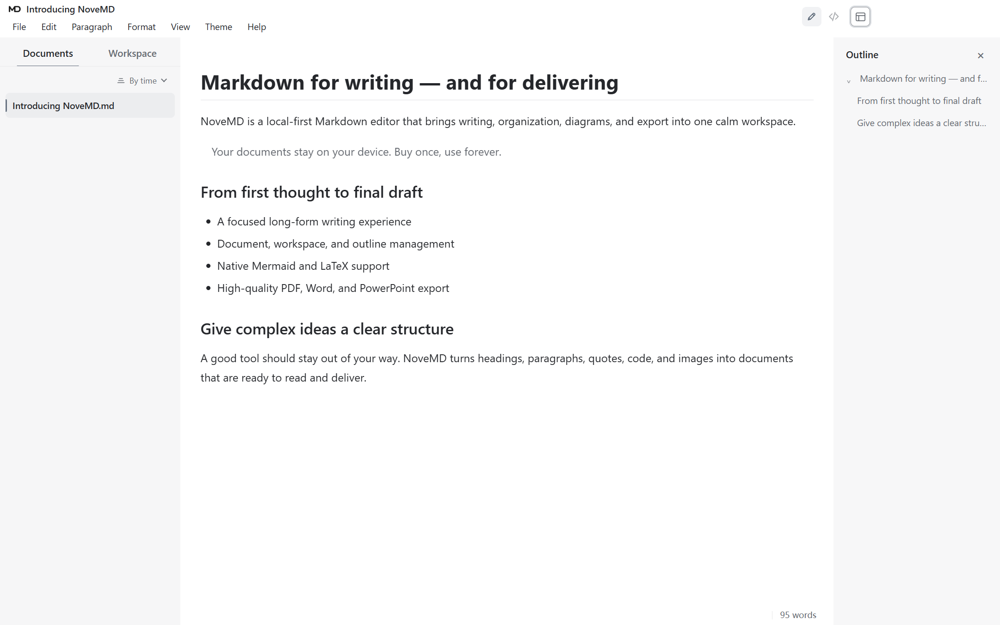
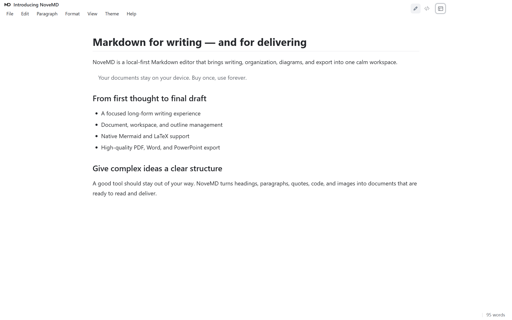
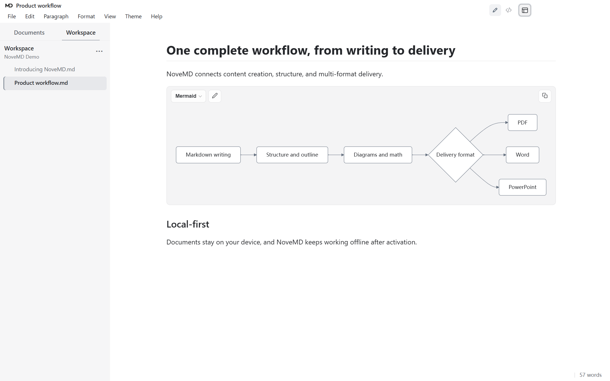

# NoveMD — Markdown Editor for Windows

<p align="center">
  
</p>

<p align="center"><strong>Write in Markdown. Deliver as PDF, Word, PowerPoint, HTML and more.</strong></p>

<p align="center"><strong>Ten interface languages:</strong> Simplified Chinese, Traditional Chinese, English, Japanese, Korean, Spanish, Russian, German, French and Brazilian Portuguese</p>

<p align="center">
  <a href="README.zh-CN.md">简体中文</a> · English<br>
  <a href="https://buer.store/download"><strong>Download 2.0.11</strong></a> ·
  <a href="../../releases/latest">GitHub Release</a> ·
  <a href="https://buer.store/pricing">Buy a perpetual licence</a>
</p>

> **Try it without locking in:** after the 30-day full-featured trial, NoveMD switches to read-only mode. You can still open, read and export ordinary `.md` files—including Markdown generated by AI. Your files are never locked; only editing requires a perpetual licence.

NoveMD is a proprietary, local-first Windows desktop application. This public repository is the official product, download and release channel; it does not contain the application source code.

## Current pricing

| Sales region | One-time price | Licence |
| --- | ---: | --- |
| Mainland China | **¥49 CNY** | Perpetual, up to 2 devices owned by the licence holder |
| International | **US$9.90 USD** | Perpetual, up to 2 devices owned by the licence holder |

No subscription and no automatic renewal. Confirm the currency and amount shown on the checkout page for your sales region before payment.

## From Markdown to deliverable documents

NoveMD does more than change a file extension. It aims to preserve headings, paragraphs, tables, mathematics, images and hyperlinks, while adapting spacing, image proportions, pagination and visual hierarchy for each target. PDF, Word, PowerPoint and HTML exports are designed to be read and delivered—not merely opened.

<table>
  <tr>
    <td width="50%"></td>
    <td width="50%"></td>
  </tr>
  <tr>
    <td align="center"><sub>PDF: stable pages for final delivery, print and archive</sub></td>
    <td align="center"><sub>Word: preserves hierarchy, tables, images and clickable links</sub></td>
  </tr>
  <tr>
    <td width="50%"></td>
    <td width="50%"></td>
  </tr>
  <tr>
    <td align="center"><sub>PowerPoint: turn Markdown structure into presentation slides</sub></td>
    <td align="center"><sub>HTML: shareable, readable and link-aware</sub></td>
  </tr>
</table>

## See NoveMD in action

### Document view: writing that already feels readable


### Three layouts: full workspace or focused reading

<table>
  <tr>
    <td width="50%"></td>
    <td width="50%"></td>
  </tr>
  <tr>
    <td align="center"><sub>Full layout: documents, content and outline together</sub></td>
    <td align="center"><sub>Focus layout: keep the document at the centre</sub></td>
  </tr>
</table>

### Mermaid diagrams and LaTeX mathematics



## What makes NoveMD different

- **AI-Markdown friendly:** open standard Markdown produced by AI as ordinary local `.md` files; reading and export remain available after the trial ends.
- **Local-first:** documents, settings, backups and history stay on your computer by default. NoveMD does not upload document contents for cloud storage, advertising or product analytics.
- **Document and source views:** write in a reading-oriented canvas or inspect the original Markdown at any time; links remain clickable in reading mode.
- **Three layouts for long documents:** combine workspaces, document lists, outlines, focus mode and typewriter mode for writing, organisation or uninterrupted reading.
- **Import existing material:** Word, PowerPoint, Excel, OpenDocument, RTF, EPUB, CSV, text-based PDF and supported HWP/HWPX/HWPML families.
- **Nine delivery outputs:** TXT, PDF, Word DOCX, styled HTML, unstyled HTML, LaTeX/TeX, presentation HTML, PowerPoint PPTX and offline reading packages.
- **Images and links that travel better:** remote-image loading and local caching, self-contained HTML images, plus compatibility work for image sizing, link retention and common Office/PDF readers.
- **Markdown presentations:** create, preview and export browser presentations or PowerPoint files from Markdown.
- **Ten interface languages:** Simplified Chinese, Traditional Chinese, English, Japanese, Korean, Spanish, Russian, German, French and Brazilian Portuguese.

While many tools concentrate on Markdown authoring, NoveMD focuses on the complete path from AI or source material to long-term reading, organisation, presentation and multi-format delivery.

## Download and verify

The current public release is **NoveMD 2.0.11** for **64-bit Windows 10 and Windows 11 on Intel or AMD processors**.

- [Download from the official website](https://buer.store/download)
- [Download from GitHub Releases](../../releases/latest)
- [Read the 2.0.11 release notes](releases/v2.0.11.md)

The installer is currently unsigned, so Windows SmartScreen may show an “Unknown publisher” warning. Download only from the official website or this repository and verify the SHA-256 supplied with the release:

```text
FFA9E1C93D707C125A9381FFA6F7AA6B51FD3C2266356A2AA663433CAC0F3B41
```

## Trial and perpetual licence

- 30-day full-featured trial; no purchase is required to start.
- After the trial, Markdown files can still be opened, read and exported; editing is paused.
- AI-generated `.md` files are ordinary Markdown. They are not tied to one AI provider and do not become unreadable when the trial ends.
- Buy once and use forever—no subscription or automatic renewal.
- One licence may be activated on up to two devices owned by the licence holder.
- Initial activation requires internet access; ordinary writing, reading and export can continue offline afterward.

## System and compatibility notes

- Supported: 64-bit Windows 10 and Windows 11 on Intel or AMD processors.
- Not supported: Windows 7/8/8.1, 32-bit Windows, macOS and Linux.
- Windows on ARM has not been formally validated.
- Scanned or image-only PDF OCR is not included in the default installer.
- Review complex third-party formats, unusual fonts and final deliverables in the target application before publication.
- Advanced LaTeX/TeX export may require the optional Pandoc component.

## Privacy, legal and support

- [Privacy Policy](https://buer.store/privacy)
- [Terms of Service](https://buer.store/terms)
- [Refund Policy](https://buer.store/refund)
- [Support and bug reports](SUPPORT.md)
- [Security reporting](SECURITY.md)
- [Proprietary software notice](LICENSE.txt)
- [Third-party notices](THIRD_PARTY_NOTICES.md)

Never post licence codes, order details, private documents, email addresses or security-sensitive information in a public GitHub issue.

## Source availability

NoveMD is closed-source commercial software. GitHub's automatically generated “Source code” archives contain only the public product documentation in this repository, not the NoveMD application source code.
