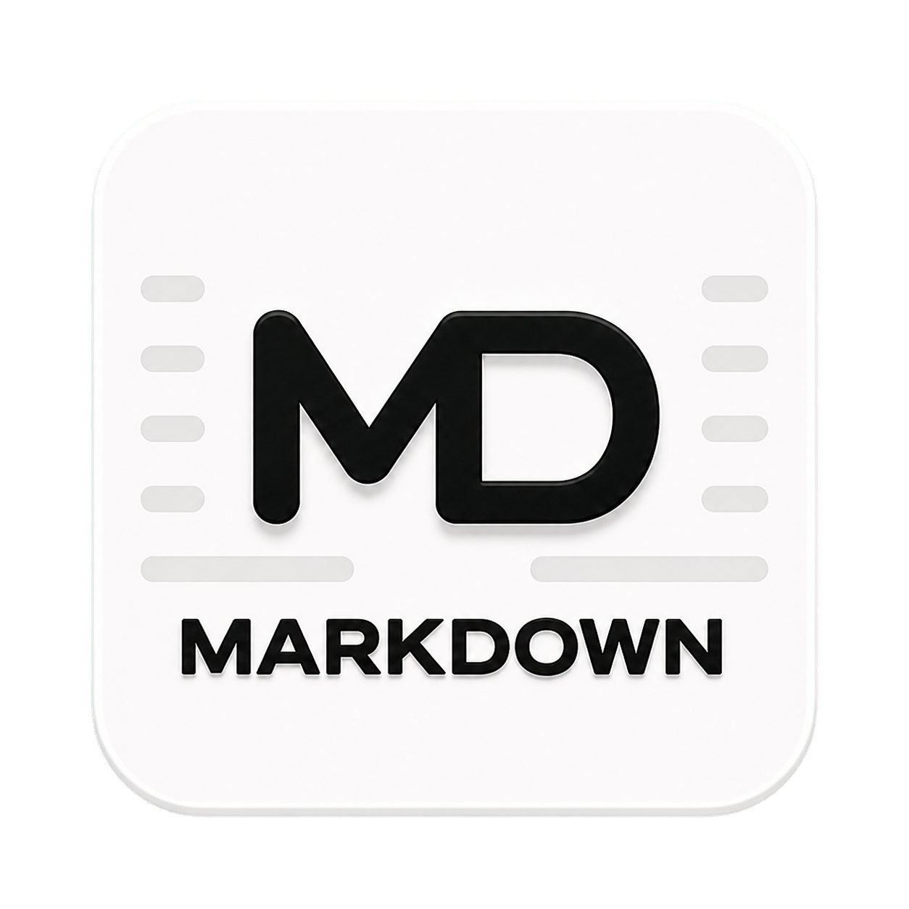

# NoveMD

<p align="center">
  
</p>

<p align="center"><strong>A local-first Markdown workspace for writing, document conversion, polished export and presentations.</strong></p>

<p align="center"><a href="README.zh-CN.md">简体中文</a> · English</p>

NoveMD is a proprietary Windows desktop application. This public repository is its official GitHub download and release-information channel; it does **not** contain the application source code.

## Why NoveMD

- **Local-first writing:** documents, preferences, backups and history stay on your computer by default. NoveMD does not upload document contents for cloud storage, advertising or product analytics.
- **Two editing views and three layouts:** switch between document and source views, choose the layout that fits writing, file management or focused reading, and open links directly in reading mode.
- **Import existing documents:** convert Word, PowerPoint, Excel, OpenDocument, RTF, EPUB, CSV, text-based PDF and supported Hangul document families into editable Markdown.
- **Deliver readable files:** export TXT, PDF, styled HTML, clean HTML, DOCX, presentation HTML, PPTX and LaTeX. An offline reading package can retain Markdown structure, links and locally available images.
- **Images and links that travel better:** remote-image loading and local caching, self-contained HTML images, and compatibility work for image sizing, link retention and document layout in common Office/PDF readers.
- **Markdown presentations:** create or preview slide documents from Markdown and export them as browser presentations or PowerPoint files.
- **Multilingual:** Simplified Chinese, Traditional Chinese, English, Japanese, Korean, Spanish, Russian, German, French and Brazilian Portuguese.

Scanned or image-only PDF OCR is not included in the default package. Complex third-party formats, unusual fonts and exported deliverables should be checked in the target application before publication.

## Download

The current public version is **NoveMD 2.0.11** for **64-bit Windows 10 and Windows 11**.

- [Download from the official website](https://buer.store/download)
- [Download from GitHub Releases](../../releases/latest)
- [Read the 2.0.11 release notes](releases/v2.0.11.md)

The installer is currently unsigned. Windows SmartScreen may show an “Unknown publisher” warning. Download only from the official website or this repository and verify the SHA-256 checksum published with the release.

PowerShell verification:

```powershell
Get-FileHash -Algorithm SHA256 -LiteralPath '.\NoveMD Setup 2.0.11.exe'
```

Expected SHA-256:

```text
FFA9E1C93D707C125A9381FFA6F7AA6B51FD3C2266356A2AA663433CAC0F3B41
```

## Trial and licence

- 30-day full-featured trial.
- When the trial ends, existing documents can still be opened, read and exported; editing requires a valid licence.
- One-time purchase with no subscription or automatic renewal.
- Region-specific one-time pricing is displayed on the official purchase and checkout pages before payment.
- One licence may be activated on up to two devices belonging to the licence holder.
- Initial activation requires internet access; ordinary use can continue offline after activation.

The current price, currency and purchase conditions are always those shown at [buer.store](https://buer.store) for the applicable sales region.

## Privacy, legal and support

- [Privacy Policy](https://buer.store/privacy)
- [Terms of Service](https://buer.store/terms)
- [Refund Policy](https://buer.store/refund)
- [Support and bug reports](SUPPORT.md)
- [Security reporting](SECURITY.md)
- [Proprietary software notice](LICENSE.txt)
- [Third-party notices](THIRD_PARTY_NOTICES.md)

Never post licence codes, order details, private documents, email addresses or security-sensitive information in a public GitHub issue.

## Source availability

NoveMD is closed-source commercial software. GitHub's automatically generated “Source code” archives for a release contain only the public documentation in this download repository, not the NoveMD application source code.
