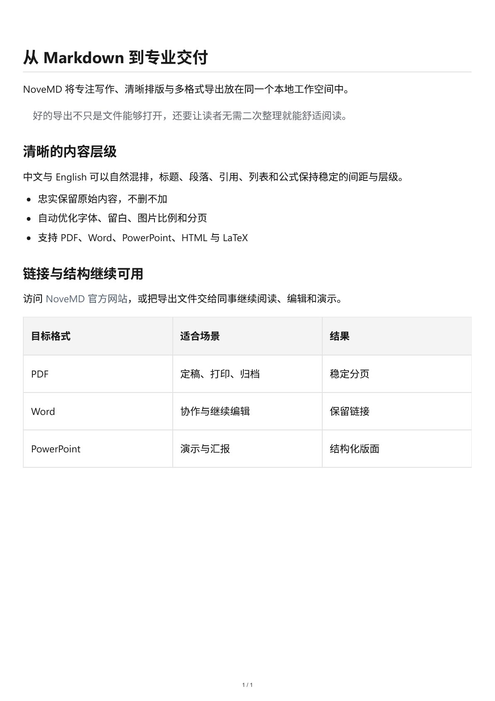
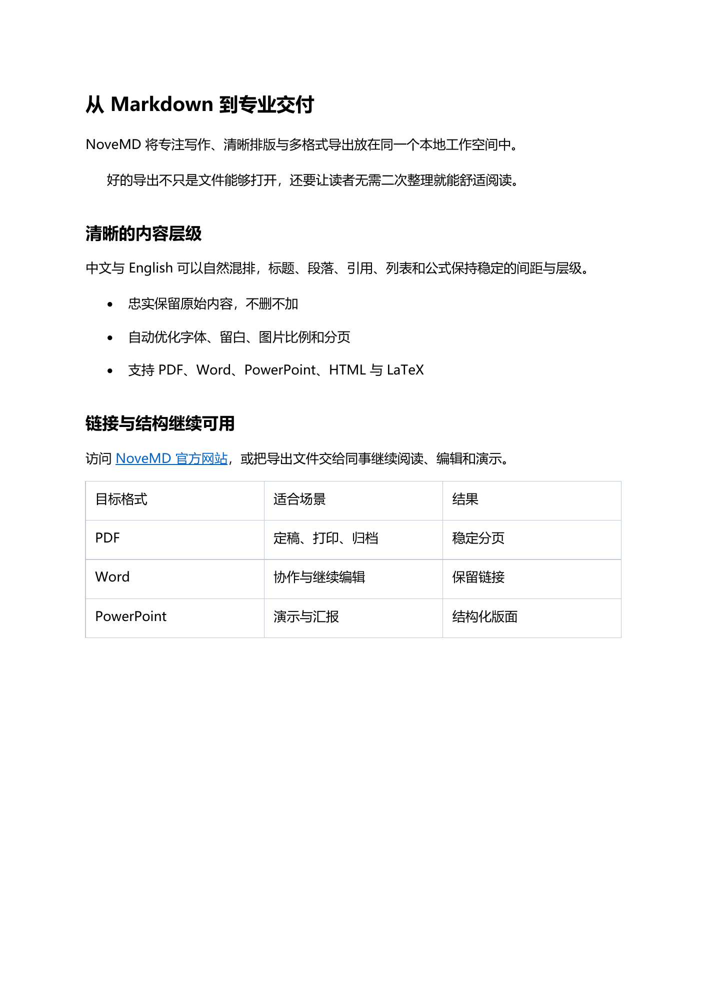
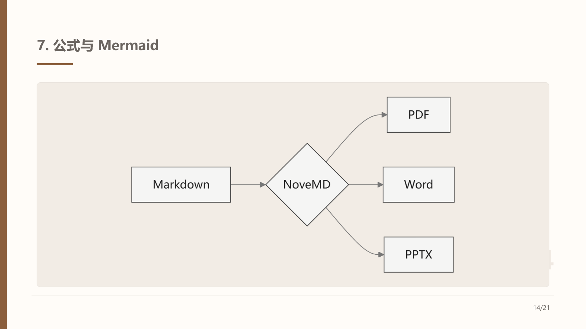
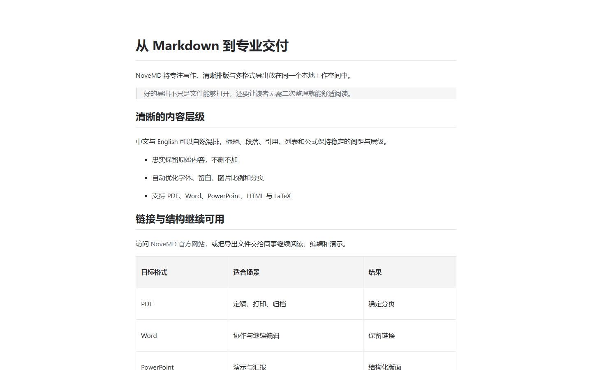
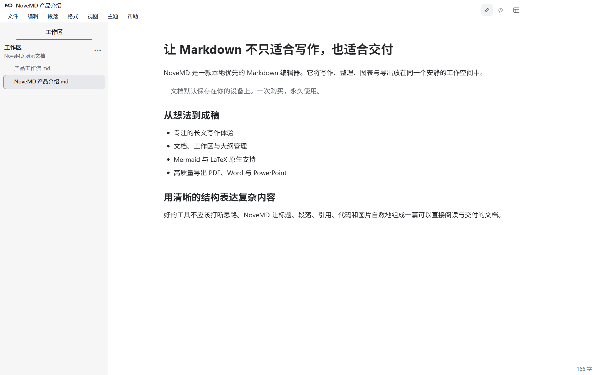
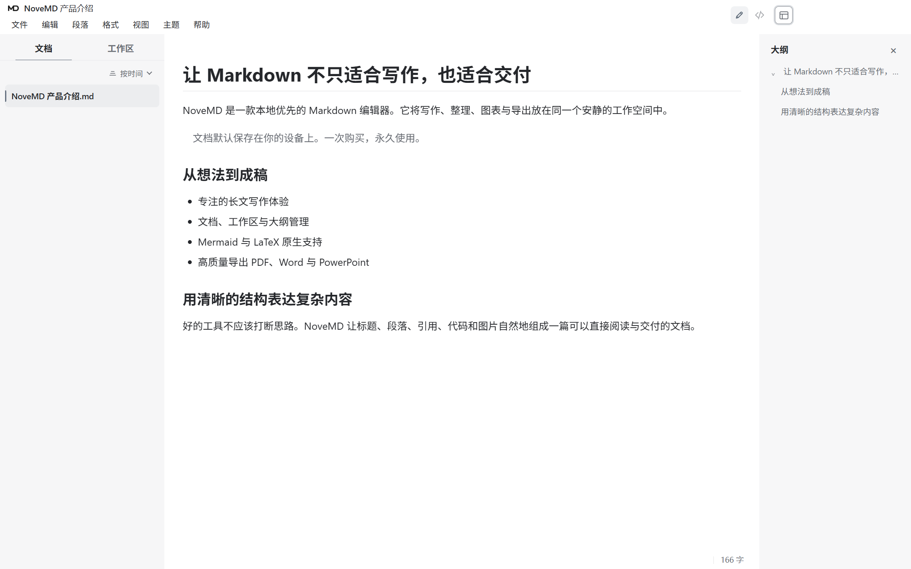
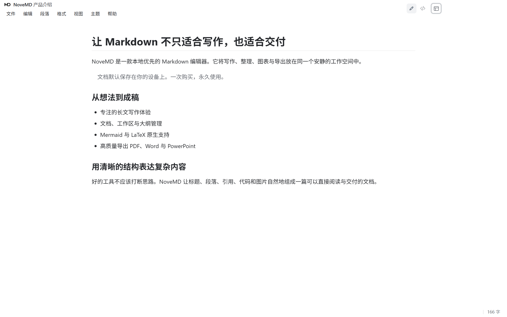
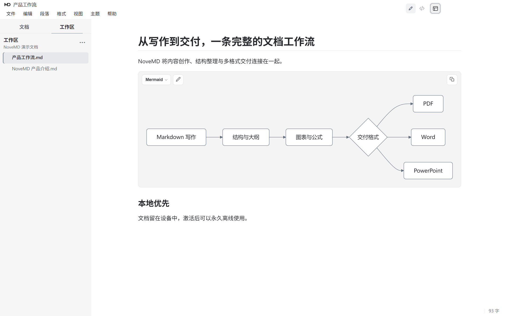

# NoveMD — Windows Markdown 编辑器

<p align="center">
  
</p>

<p align="center"><strong>用 Markdown 专注写作，把成果交付为 PDF、Word、PowerPoint、HTML 等常用格式。</strong></p>

<p align="center"><strong>支持十种界面语言：</strong>简体中文、繁体中文、英语、日语、韩语、西班牙语、俄语、德语、法语、巴西葡萄牙语</p>

<p align="center">
  简体中文 · <a href="README.md">English</a><br>
  <a href="https://buer.store/download"><strong>下载 2.0.12</strong></a> ·
  <a href="../../releases/latest">GitHub Release</a> ·
  <a href="https://buer.store/pricing">购买永久授权</a>
</p>

> **放心试用：** 30 天全功能试用结束后，NoveMD 会进入只读模式。你仍可打开、阅读并导出普通 `.md` 文件，包括由 AI 生成的 Markdown；文件不会被锁定，只有继续编辑需要永久授权。

NoveMD 是一款本地优先的闭源 Windows 桌面软件。本公开仓库是官方产品介绍、下载和版本发布渠道，不包含应用源代码。

## 当前价格

| 销售地区 | 一次性价格 | 授权方式 |
| --- | ---: | --- |
| 中国大陆 | **¥49 CNY** | 永久授权，最多激活 2 台本人设备 |
| 海外地区 | **US$9.90 USD** | 永久授权，最多激活 2 台本人设备 |

无订阅、无自动续费。付款前请以对应地区结账页显示的币种与金额为准。

## 从 Markdown 到可交付文档

NoveMD 的优势不只是导出不同文件后缀。它会尽量保留原文的标题层级、段落、表格、公式、图片和超链接，并针对不同载体优化留白、图片比例、分页和阅读层次，让 PDF、Word、PowerPoint 与 HTML 更接近可以直接阅读和交付的成品。

<table>
  <tr>
    <td width="50%"></td>
    <td width="50%"></td>
  </tr>
  <tr>
    <td align="center"><sub>PDF：稳定分页，适合定稿、打印和归档</sub></td>
    <td align="center"><sub>Word：保留层级、表格、图片和可点击链接</sub></td>
  </tr>
  <tr>
    <td width="50%"></td>
    <td width="50%"></td>
  </tr>
  <tr>
    <td align="center"><sub>PowerPoint：把 Markdown 结构变成可演示的幻灯片</sub></td>
    <td align="center"><sub>HTML：可分享、可阅读，并保留链接</sub></td>
  </tr>
</table>

## 看见真实的 NoveMD

### 文档视图：写作也是阅读



### 三种布局：完整工作区或专注阅读

<table>
  <tr>
    <td width="50%"></td>
    <td width="50%"></td>
  </tr>
  <tr>
    <td align="center"><sub>完整布局：文档、正文与大纲同时可见</sub></td>
    <td align="center"><sub>专注布局：让内容成为屏幕中心</sub></td>
  </tr>
</table>

### Mermaid 图表与 LaTeX 公式



## NoveMD 的核心优势

- **AI Markdown 友好：** AI 输出的标准 Markdown 可以直接作为本地 `.md` 文件打开；即使试用结束，也不影响继续阅读和导出。
- **本地优先：** 文档、设置、备份和历史默认留在你的电脑上，不为云存储、广告或产品分析上传文档正文。
- **文档与源码两种视图：** 既能在阅读型画布中写作，也能随时检查原始 Markdown；阅读模式中的链接可以点击。
- **三种布局与长文工具：** 根据写作、文件管理或专注阅读切换布局，并提供工作区、大纲、专注模式和打字机模式。
- **导入现有资料：** 支持 Word、PowerPoint、Excel、OpenDocument、RTF、EPUB、CSV、文本型 PDF，以及受支持的 HWP/HWPX/HWPML 文档族。
- **九类交付输出：** TXT、PDF、Word DOCX、有样式 HTML、无样式 HTML、LaTeX/TeX、演示 HTML、PowerPoint PPTX 和离线阅读包。
- **更可靠的图片与链接：** 支持远程图片加载与本地缓存、HTML 图片内嵌，并持续优化图片尺寸、链接保留和常见 Office/PDF 阅读器兼容性。
- **Markdown 演示：** 从 Markdown 创建、预览并导出浏览器演示或 PowerPoint 文件。
- **十种界面语言：** 简体中文、繁体中文、英语、日语、韩语、西班牙语、俄语、德语、法语和巴西葡萄牙语。

与主要聚焦 Markdown 编辑的工具相比，NoveMD 更重视从“AI/资料产生 Markdown”到“长期阅读、整理、演示和多格式交付”的完整流程。

## 下载与校验

当前公开版本为 **NoveMD 2.0.12**，适用于 **Windows 10/11 64 位系统（Intel 或 AMD）**。

- [从官方网站下载](https://buer.store/download)
- [从 GitHub Releases 下载](../../releases/latest)
- [查看 2.0.12 版本说明](releases/v2.0.12.md)

安装包目前尚未进行代码签名，Windows SmartScreen 可能显示“未知发布者”。请只从官方网站或本仓库下载，并核对 Release 同时提供的 SHA-256：

```text
E846358505F14C8DF65D29E08F5928522D2A098D45B09E18E58E8E6FFF0EAE89
```

## 试用与永久授权

- 30 天全功能试用，无需先购买。
- 试用结束后仍可打开、阅读和导出 Markdown；编辑功能暂停。
- AI 生成的 `.md` 是普通 Markdown 文件，不依赖某一家 AI 平台，也不会因试用结束失去可读性。
- 一次购买、永久使用，不是订阅制，不会自动续费。
- 一份授权最多可在授权持有人的两台设备上激活。
- 首次激活需要联网；激活后日常写作、阅读和导出可离线完成。

## 系统与兼容性说明

- 支持：Windows 10、Windows 11，64 位 Intel/AMD 处理器。
- 暂不支持：Windows 7/8/8.1、32 位 Windows、macOS、Linux。
- Windows on ARM 尚未完成正式验收。
- 默认安装包不包含扫描型或纯图片 PDF 的 OCR。
- 复杂第三方格式、特殊字体和正式交付文件仍建议在目标软件中做最终检查。
- LaTeX/TeX 高级导出可能需要按需安装可选 Pandoc 组件。

## 隐私、条款与支持

- [隐私政策](https://buer.store/privacy)
- [服务条款](https://buer.store/terms)
- [退款政策](https://buer.store/refund)
- [支持和问题反馈](SUPPORT.md)
- [安全问题报告](SECURITY.md)
- [专有软件声明](LICENSE.txt)
- [第三方软件声明](THIRD_PARTY_NOTICES.md)

请勿在公开 GitHub Issue 中发布激活码、订单资料、私人文档、邮箱地址或安全敏感信息。

## 关于源代码

NoveMD 是闭源商业软件。GitHub 在 Release 页面自动生成的 “Source code” 压缩包只包含这个公开仓库中的产品说明，不包含 NoveMD 应用源码。
