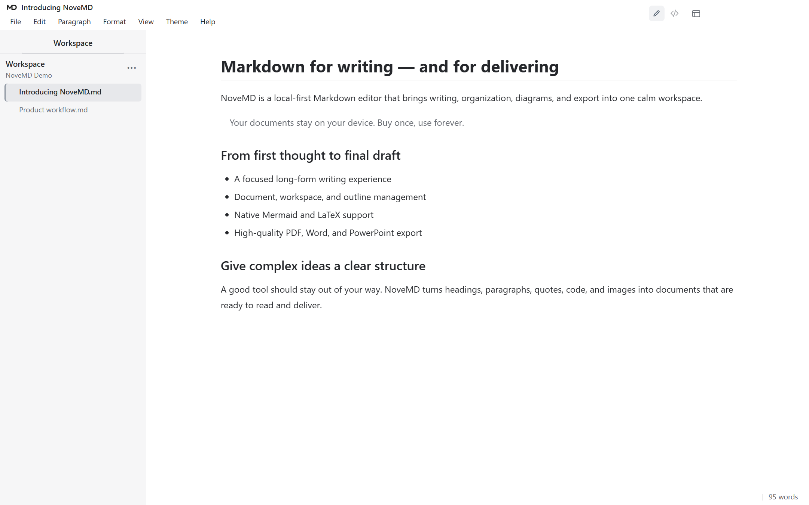

# NoveMD 2.0.11

Release date: 7 September 2026<br>
Platform: Windows 10/11, 64-bit

> 30 天全功能试用结束后，普通 Markdown（包括 AI 生成的 `.md`）仍可打开、阅读和导出，只有编辑需要永久授权。中国大陆一次性价格 **¥49 CNY**；海外一次性价格 **US$9.90 USD**。无订阅、无自动续费。

> After the 30-day full-featured trial, ordinary Markdown—including AI-generated `.md` files—can still be opened, read and exported. Only editing requires a perpetual licence. One-time pricing is **¥49 CNY** in Mainland China and **US$9.90 USD** internationally, with no subscription or automatic renewal.

## 产品界面 / Product interface



## 导出效果 / Export quality

NoveMD 不只是改变文件后缀；它会尽量保留结构、图片和链接，并针对 PDF、Word、PowerPoint 与 HTML 的阅读场景优化排版。

NoveMD does more than change a file extension: it aims to retain structure, images and links while adapting layout for PDF, Word, PowerPoint and HTML.

<table>
  <tr>
    <td width="50%"></td>
    <td width="50%"></td>
  </tr>
  <tr>
    <td width="50%"></td>
    <td width="50%"></td>
  </tr>
</table>

## 中文版本说明

NoveMD 2.0.11 是当前 Windows 正式版本。本版重构了多语言文档统计口径，修正中英文混排、日韩文字、Emoji、Markdown 结构及代码等内容的统计结果；同时删除失去实际作用的“快速上手”入口，重新整理文件、编辑、视图和帮助菜单，并将“设为默认 Markdown 应用”移入偏好设置。已验证运行 2.0.11 安装包从 2.0.10 原位升级时，用户文档及应用状态能够保留。

NoveMD 提供文档/源码两种视图、三种布局、阅读模式、远程图片缓存、可点击链接、Office/PDF 等多类文档导入，以及 TXT、PDF、有样式/无样式 HTML、DOCX、演示 HTML、PPTX、LaTeX 和离线阅读包等九类导出能力。它关注的不只是格式转换，还包括标题层级、段落、表格、公式、图片比例、分页和超链接在目标阅读器中的呈现。

界面支持十种语言：简体中文、繁体中文、英语、日语、韩语、西班牙语、俄语、德语、法语和巴西葡萄牙语。

系统要求：Windows 10/11 64 位。默认安装包不包含扫描 PDF OCR。安装包目前未签名，Windows 可能显示“未知发布者”，请核对随 Release 提供的 SHA-256 校验值。

## English release notes

NoveMD 2.0.11 is the current production Windows release. It improves multilingual document statistics for mixed CJK text, Korean and Japanese text, emoji, Markdown structures and code; removes the obsolete Quick Start entry; reorganises the File, Edit, View and Help menus; and moves the default-Markdown-app action into Preferences. An in-place upgrade by running the 2.0.11 installer over 2.0.10 has been verified to preserve user documents and application state.

NoveMD includes document/source views, three layouts, reading mode, remote-image caching, clickable links, broad Office/PDF document import, and nine delivery outputs: TXT, PDF, styled/unstyled HTML, DOCX, presentation HTML, PPTX, LaTeX and offline reading packages. Its export work covers hierarchy, paragraphs, tables, mathematics, image proportions, pagination and hyperlink presentation—not just format conversion.

The interface is available in ten languages: Simplified Chinese, Traditional Chinese, English, Japanese, Korean, Spanish, Russian, German, French and Brazilian Portuguese.

Requirements: 64-bit Windows 10 or Windows 11. Scanned-PDF OCR is not included. The installer is currently unsigned; verify the SHA-256 file supplied with the release if Windows displays an “Unknown publisher” warning.

## Files / 文件

- `NoveMD.Setup.2.0.11.exe`
- `SHA256SUMS.txt`

SHA-256:

```text
FFA9E1C93D707C125A9381FFA6F7AA6B51FD3C2266356A2AA663433CAC0F3B41
```

Official website / 官方网站: https://buer.store
